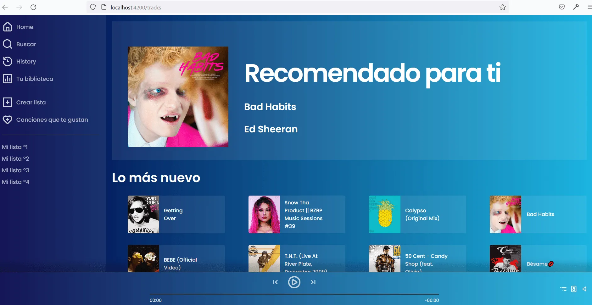
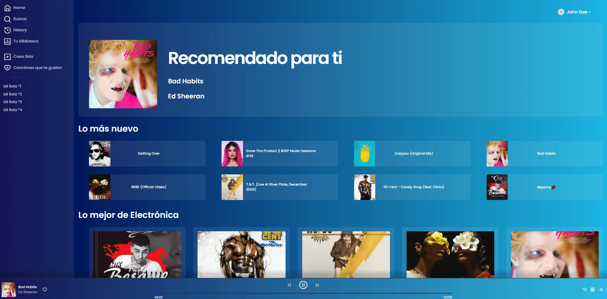
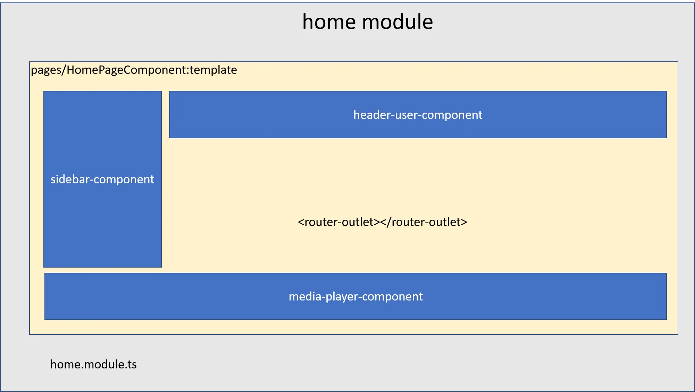

# My-spotify

 
My-spotify is a simple app based on Spotify app.
The application has a multimedia player that allows you to play and pause a song. Additionally, the multimedia controller allows you to advance or rewind a song by clicking with the mouse at any point on the progress bar.

The application obtains the songs through http requests to a [REST API](https://github.com/leifermendez/node-api-tracks) developed in Node.js 

**Content**
 * [User Interfaces](#problem-introduction)
   - [Login Form](#login-form)
   - [Home Page](#home-page)
   - [Search Page](#search-page)
   - [History Page](#history-page)
   - [Liked Songs Page](#liked-songs)
   - [Media player in action](#media-player-in-action)
 * [Architecture ](#architecture)
   - [OverView](#overview)
   - [Home Module](#home-module)
 * [Technologies](#technologies) 

## Login Form

 

## Home Page

 
## Media player in action
The multimedia controller allows you to play songs from any page that includes a play button. 

  

 

 

    

## Search Page

## History Page

## Liked Songs

## Architecture 

### OverView

### Home Module

 
## Technologies

 

